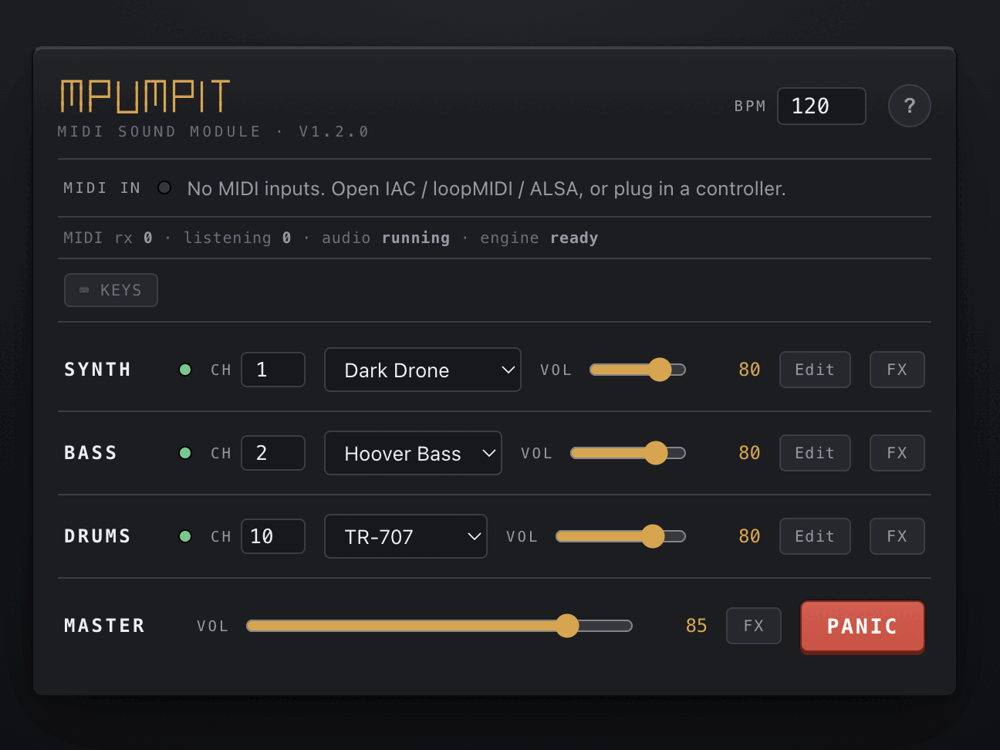

<div align="center">



# mpumpit

### a browser MIDI sound module

**Plug a sequencer in. Get sound out.**

[](https://github.com/gdamdam/mpumpit/actions/workflows/ci.yml)
[](./LICENSE)
[](./CHANGELOG.md)
[](#manual-verification)


<br>


</div>

---

A tiny browser-based **MIDI sound module** — the companion for
[midip](https://github.com/gdamdam/midip). It exposes
[mpump](https://github.com/gdamdam/mpump)'s Web Audio synth/bass/drum engine and
its full effects chain as a playable instrument that responds to incoming MIDI.

It is **not** a sequencer and not a clone of mpump. midip (or any sequencer,
DAW, or controller) sends MIDI; mpumpit makes the sound.

```
MIDI IN  ◉  [ input ▾ ]                    BPM 120   ?
SYNTH    ●  CH 1   [ preset ▾ ] [Edit]  vol 80   FX
BASS     ●  CH 2   [ preset ▾ ] [Edit]  vol 80   FX
DRUMS    ●  CH 10  [ kit ▾ ]    [Edit]  vol 80   FX
MASTER              vol 85          FX  [ PANIC ]
```

## What it does

- Receives notes from a virtual MIDI port (e.g. midip), a USB controller, or any
  Web MIDI input — including an **All MIDI inputs** mode.
- Routes by MIDI channel to three parts: **synth**, **bass**, **drums**.
- Velocity-sensitive note on/off, with robust active-note tracking (no hung notes
  on duplicate Note Ons, late Note Offs, device removal, or config changes).
- mpump's complete master FX chain (11 effects, reorderable) plus a per-part
  channel strip (EQ / HPF / pan / trance gate), with a global BPM for
  tempo-synced effects.
- A full **sound editor** per part — every synth/drum parameter, with live ADSR,
  filter-response and LFO visualizations — plus **Save as…** user presets.
- A built-in **computer-keyboard** input (Ableton layout) for playing without
  MIDI gear.
- A permanent **PANIC** button, persistent settings, and best-effort cleanup on
  page hide.

## Browser requirements

- **Chrome or Edge** (current). Web MIDI is not available in Safari or Firefox.
- A **secure context**: `https://…` or `http://localhost`. Web MIDI is disabled
  on plain `http://` origins.
- Audio starts only after a click (browser autoplay policy) — press **Start
  Audio**. MIDI received before that is queued, not dropped.

## Install & develop

```bash
npm install
npm run dev        # Vite dev server (localhost — a secure context for Web MIDI)
npm run build      # type-check + production build to dist/
npm run preview    # serve the production build
npm test           # run the test suite (Vitest)
npm run typecheck  # type-check only
```

## Deploy (GitHub Pages)

A workflow (`.github/workflows/deploy.yml`) builds and publishes `dist/` to
GitHub Pages on every push to `main`. One-time setup: in the repo, **Settings →
Pages → Source: GitHub Actions**. It then serves at
`https://<owner>.github.io/mpumpit/` (the app uses a relative base, so the
subpath and its AudioWorklets resolve correctly). Note: Web MIDI needs HTTPS —
GitHub Pages is HTTPS, so it works.

## Connecting midip (or any same-computer app)

A program on the same machine reaches the browser through a **virtual MIDI
port**:

- **macOS** — open *Audio MIDI Setup → Window → Show MIDI Studio*, double-click
  **IAC Driver**, tick *Device is online*, and ensure a port exists. Point midip
  at the IAC bus, then select it in mpumpit's **MIDI IN**.
- **Windows** — install **loopMIDI**, create a port, send midip to it, and select
  it in mpumpit.
- **Linux** — load an ALSA virtual MIDI (e.g. `modprobe snd-virmidi`) or wire
  midip to mpumpit with `aconnect`.

### A physical USB controller

Plug it in and pick it directly in **MIDI IN** — no virtual port needed.

mpumpit **never opens a MIDI output**, so there is no possibility of a feedback
loop back to midip.

### Computer keyboard (no MIDI gear)

Click **⌨ Keys** to play from your computer keyboard using the Ableton-style
layout, and pick which part it plays:

```
  W E   T Y U       O P          ← black keys
 A S D F G H J K   L ;           ← white keys (A = middle C)
 Z X = octave down/up   C V = velocity down/up
```

It routes through the same engine as MIDI, so panic, activity, and ownership all
apply. Typing in a number/menu field is ignored so it never fires stray notes.

## Default channel assignments

| Part  | MIDI channel | mpump engine channel |
|-------|--------------|----------------------|
| Synth | 1            | 0                    |
| Bass  | 2            | 1                    |
| Drums | 10           | 9 (GM drums)         |

Every channel is editable per part on the main panel and is persisted.

## Drums & midip compatibility

midip and mpump both use GM-ish drum notes, but the **voices differ** — matching
note numbers don't guarantee matching instruments. mpumpit ships a documented,
editable compatibility map (Settings → *Drum map*).

| midip note | midip lane | plays in mpump |
|-----------:|------------|----------------|
| 36 | BD (kick)       | kick |
| 37 | RS (rimshot)    | rimshot |
| 38 | SD (snare)      | snare |
| 42 | CH (closed hat) | closed hat |
| 46 | OH (open hat)   | open hat |
| 47 | MT (mid tom)    | **cowbell** (mpump has no toms) |
| 49 | CC (crash)      | crash |
| 50 | HT (high tom)   | **clap** (mpump has no toms) |
| 51 | RC (ride)       | ride |
| 56 | CB (cowbell)    | cowbell |

All ten lanes are audible by default. Because mpump synthesizes no tom voices,
midip's tom lanes (47, 50) play cowbell/clap; remap them in Settings if you
prefer different voices.

## Effects

mpump's effects are a **master bus chain** (reorderable) — not independent
per-instrument chains — so mpumpit represents them honestly:

- **Master FX** — 11 effects: compressor, high-pass, distortion, bitcrusher,
  chorus, phaser, flanger, delay, reverb, tremolo, and a kick-triggered sidechain
  duck. Each can be enabled/bypassed, has editable parameters and wet/dry where
  applicable, and exposes per-part **Applies to** toggles (mpump's exclude flags).
  Order is editable with up/down (duck is pinned, matching mpump). **Delay** is
  tempo-synced to the global **BPM**.
- **Per-part channel strip** — each part has its own EQ (low/mid/high), high-pass,
  pan, and trance gate. These are fixed processing, not a reorderable chain.

Parameter changes use mpump's short crossfade rebuild, so editing FX while notes
play does not click. Changing a preset preserves the current effects (mpump's
behavior). MIDI Clock messages are ignored safely; clock **sync** is deferred.

## Sound editor

Each part row has an **Edit** button that opens a full-screen editor for that
part's sound — every engine parameter, with live visual feedback:

- **Synth / bass** — OSCILLATOR (wave + per-type FM/sync/wavetable/unison, ADSR
  with a live **envelope curve**, detune, sub, gain), FILTER (type/model with a
  live **response curve**, cutoff, resonance, env, drive), and LFO (shape,
  target, free/tempo-synced rate, depth, with a shape preview).
- **Drums** — pick a voice (BD/SD/CH/…), edit its full parameters (tune, decay,
  level, pan, click, sweep, noise, color, LPF), and **▶ Test** it.

Presets are the starting point; edits are a **live override** that persists. A
**✎** marks a part whose sound differs from its preset. **Save as…** stores named
**user presets** (in `localStorage`) alongside the built-ins; **Reset** reloads
the preset's values; selecting any preset discards edits.

## Computer keyboard

Click **⌨ Keys** to play without MIDI gear, using the Ableton-style layout (A = C3
home row, W/E/T/Y/U/O/P black keys, Z/X octave, C/V velocity). Pick which part it
plays. For drums the white row becomes a pad layout (A = kick, S = rim, …).
**Direct** routing plays the part directly; **Over MIDI** layers it through the
MIDI router (channels + drum-map apply), like an external controller.

## Persistence

Input preference, channel routing, presets, per-part volumes + sound params +
saved user presets, BPM, the full FX chain (order / bypass / parameters),
per-part strips, and drum-map overrides are saved to `localStorage` and restored
on load. *Settings → Reset* clears them.

## Licensing & attribution

mpumpit is licensed **AGPL-3.0-only** (see [LICENSE](./LICENSE)).

It embeds and drives the audio engine of **mpump — Instant browser groovebox**,
Copyright © 2024–2026 gdamdam (<https://github.com/gdamdam>), which is
AGPL-3.0-only. Because mpumpit is a derivative work of that engine, the whole is
distributed under the same license; the engine code is **not** relicensed. See
[NOTICE](./NOTICE) for the list of files copied or derived from mpump.

## Known limitations

- Web MIDI works only in Chromium browsers and only in a secure context
  (HTTPS/localhost).
- A hot-plugged input is picked up via the device `statechange` event; some
  OS/driver combinations report virtual ports slowly.
- MIDI Clock sync, Program Change, sequencing, recording, and a MIDI output are
  intentionally out of scope.

## Manual verification

Automated tests cover MIDI parsing, channel routing, note ownership, panic,
disconnect cleanup, persistence, the drum map, the pre-ready queue, and the full
app flow with mocked Web MIDI + Web Audio. The following need a real browser
(they can't run headless here) — run them once after `npm run preview`:

1. **Start Audio** produces sound (play a note from your controller/midip).
2. Channels 1 / 2 / 10 reach synth / bass / drums.
3. Changing a preset or kit causes no hung notes.
4. Unplugging a controller stops all notes it was holding.
5. **PANIC** silences everything (double-click for a hard mute that cuts FX tails).
6. Refreshing or changing channels/inputs/presets leaves no sustained sound.
7. The production build loads its AudioWorklets (check DevTools → Network for
   `worklets/poly-synth.js` etc. returning 200).
